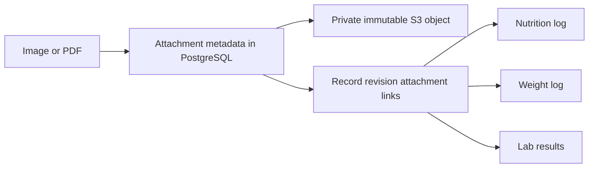

# Attachments

Upload an image or PDF once, then reuse its ID on any number of health records. One nutrition record's attachment supports its calories and nutrients together. Separate nutrition, measurement or other records can reference the same ID. A laboratory batch can share one PDF through `shared_metadata.attachment_ids`.

## Storage model



PostgreSQL stores the filename, MIME type, byte length, SHA-256, status, timestamps and internal storage location. The `record_attachments` table connects each asset to specific record revisions. Referencing an ID never copies the file. This is reuse by ID; separately uploading the same file does not automatically deduplicate it.

Attachments start `pending`, become `ready` after verification, and become `expired` when abandoned uploads are pruned. Signed uploads only write staging objects under `<S3_PREFIX>/uploads/`. Completion verifies the actual bytes and stores the final file under `<S3_PREFIX>/objects/`. Replaying a staging URL cannot overwrite a completed file. Temporary staging copies are cleaned after the upload URL expires.

## File limits

- Maximum **20 MB (20,000,000 bytes)** per file; empty files are rejected.
- Supported formats: PDF, JPEG, PNG, WebP, GIF, AVIF, HEIC, HEIF, TIFF and BMP. SVG, HTML and arbitrary binary files are rejected.
- Supply the actual byte length and lowercase SHA-256 hex digest. Completion verifies size, checksum and detected MIME type against the original bytes.
- Filenames allow at most 200 characters, without paths or control characters.
- Each record supports 20 distinct attachment IDs; any number of records can reuse them.

Signature detection identifies the format. It does not perform OCR, extract lab values, interpret reports or scan files for malware. Files are source data, never instructions to execute. Downloads use attachment disposition and `private, no-store` caching.

## REST and MCP operations

| MCP tool                            | REST route                           | Purpose                                             |
| ----------------------------------- | ------------------------------------ | --------------------------------------------------- |
| `health_create_attachment_upload`   | `POST /v1/attachments/uploads`       | Reserve metadata and obtain a signed PUT URL        |
| `health_complete_attachment_upload` | `POST /v1/attachments/{id}/complete` | Verify bytes and make the asset ready               |
| `health_get_attachment`             | `GET /v1/attachments/{id}`           | Read metadata and status                            |
| `health_list_attachments`           | `GET /v1/attachments`                | Paginate metadata, optionally for a record/revision |
| `health_get_attachment_download`    | `GET /v1/attachments/{id}/download`  | Obtain a five-minute signed GET URL                 |

REST requests use a generated API key or `AUTH_KEY`. Mutations require `Idempotency-Key`; MCP uses `idempotency_key`. OAuth uploads/completion require `health:write`, while metadata/downloads require `health:read`. Browser sessions can read files and cannot upload them. Assets belong to the existing personal ledger, rather than to the key that uploaded them.

### Reserve, upload and complete

Calculate the file's length and SHA-256 locally. Send JSON to `POST /v1/attachments/uploads` with a new idempotency key. Replace the illustrative length and digest with the file's real values:

```json
{
  "filename": "meal.jpg",
  "content_type": "image/jpeg",
  "byte_length": 123456,
  "sha256": "0123456789abcdef0123456789abcdef0123456789abcdef0123456789abcdef"
}
```

The response includes `attachment.id` and `upload` with `url`, `method`, `headers` and `expires_at`. The signed URL lasts up to 15 minutes and binds the staging key, PUT method, content type and exact Content-Length. A retry with the same key retains the same ID and expiration. Different arguments with a committed key return `IDEMPOTENCY_CONFLICT`.

PUT the original binary file to `upload.url`, using the returned headers. Curl sets the content length from the file:

```sh
curl --fail-with-body --request PUT \
  --header 'Content-Type: image/jpeg' \
  --upload-file ./meal.jpg \
  "$VITALOG_UPLOAD_URL"
```

Keep `VITALOG_UPLOAD_URL` private. Never send Vitalog credentials to storage. Browser clients should send a File/Blob of the declared size; the browser sets Content-Length. Configure bucket CORS for intended browser clients when needed.

Call `POST /v1/attachments/{id}/complete` with `{}` and a new `Idempotency-Key`. Missing uploads, wrong checksums, wrong sizes/types and expired upload windows fail without making the file ready. Retry transient failures with the exact arguments and key.

MCP uses the same workflow: `health_create_attachment_upload`, HTTP PUT through the client's file-transfer capability, then `health_complete_attachment_upload`. A file selected in an MCP host is not automatically transferred to Vitalog. A host unable to send bytes can reuse an ID uploaded through REST. Files are not base64-encoded in tool arguments; the existing 1 MiB JSON request limit remains.

### Link a ready attachment

Supply **top-level** `attachment_ids` on a logging request:

```json
{
  "occurred_on": "2026-10-01",
  "attachment_ids": ["00000000-0000-4000-8000-000000000001"],
  "provenance": { "source_type": "manual", "value_kind": "estimated" },
  "data": {
    "entry_kind": "intake",
    "label": "Lunch",
    "nutrients": { "energy_kcal": 430, "protein_g": 26 }
  }
}
```

Replace the illustrative ID with a ready attachment. Measurements set the list on each `records` entry. Lab results set it per entry or in `shared_metadata`; a per-entry list overrides the shared list. Missing, pending or expired IDs reject the whole batch.

For existing records, use a correction with a complete replacement and current `expected_version`. Its list determines the new attachments; omit it or send `[]` to detach current references. Earlier revisions retain their IDs and file references. Voiding also retains files. No attachment deletion tool can invalidate shared/historical links.

## Read files

Listings accept `record_id`, optional `record_version`, `status`, `limit` (1–100, default 50) and `cursor`. Without a version, use the record's current revision. Keep filters/page size unchanged when following a cursor; a changed current revision requires restarting the listing. Metadata remains available when storage is disabled.

Download URLs last five minutes. Upload/download URLs grant access to anyone holding them and remain valid until expiration independently of ledger token revocation. They are not stored in PostgreSQL or operational logs. Do not save them in notes, shared Postman environments or source control. Fetch fresh state with `health_get_attachment`; idempotent mutation responses preserve their original committed snapshot. A reservation retry after completion or pruning returns `upload: null`.

## Configure storage

Storage is optional. Without `S3_BUCKET`, the ledger still runs and upload/completion/download operations return `UNAVAILABLE`. Set these variables on the **API**, never the web app:

| Variable                                   | Purpose                                                                              |
| ------------------------------------------ | ------------------------------------------------------------------------------------ |
| `S3_BUCKET`                                | Dedicated private bucket; enables attachments                                        |
| `S3_ACCESS_KEY_ID`, `S3_SECRET_ACCESS_KEY` | Bucket-scoped service credentials                                                    |
| `S3_ENDPOINT`                              | Client-accessible HTTPS S3 origin; omit for AWS. Loopback HTTP is supported locally. |
| `S3_REGION`                                | Default `us-east-1`; use `auto` for R2                                               |
| `S3_FORCE_PATH_STYLE`                      | `true`/`false`; defaults to true for custom endpoints and false for AWS              |
| `S3_PREFIX`                                | Dedicated namespace, default `vitalog`; safe segments, no trailing slash             |

Compose forwards these optional variables from `.env`. For Towbar, supply them as API runtime secrets and add the enabled names to `.towbar/services/vitalog.service.yml`'s `secrets.runtime` list before deploying your storage-enabled installation. The default manifest stays usable without storage. Declare the bucket and credential variables plus custom endpoint, region or prefix values needed by the provider.

Provision the bucket separately with public access disabled. Scope object GET/PUT/DELETE and prefix LIST permissions to this ledger's namespace. Keep S3/ingress logs free of signed query strings. Configure a lifecycle rule to expire `<S3_PREFIX>/uploads/` after one day; never apply it to `objects/`. Browser bucket CORS should permit intended origins and PUT/GET with Content-Type/Content-Length. Signed URLs use the S3 API endpoint, not a bucket website/custom-domain endpoint.

Bucket/endpoint changes require a file migration; stored locations are checked against configuration. Existing objects retain their original keys when `S3_PREFIX` changes. The adapter uses standard PUT, HEAD, conditional GET, GET signing, DELETE and LIST, without requiring newer provider-specific checksum APIs. Vitalog verifies SHA-256 itself. MinIO interoperability is tested locally; verify the same flow on your chosen provider before production use.

## Backups, cleanup and erasure

Database dumps and `operator:export` include metadata, revision links and idempotency snapshots, **not file bytes**. Back up the private bucket along with PostgreSQL and preserve object keys. Restoring the database cannot restore lost files.

Run `npm run operator:attachments:prune` with database and matching storage configuration after upload URLs expire. It removes staging files for completed/abandoned uploads, marks abandoned assets expired, and retains IDs/retry history. It never removes final files. Row locks coordinate it with completion; retries and concurrent runs are safe. Run it periodically through your existing scheduler, with the staging lifecycle rule as a storage fallback.

The production image includes the compiled operator command:

```sh
docker compose exec -T api node dist/scripts/attachments-prune.js
```

Stop the API before `operator:erase -- --confirm-permanent-erasure=ERASE_VITALOG`. Erasure removes stored objects before truncating records, attachments, revision links, goals and retry metadata. Missing/mismatched storage configuration fails before database erasure. The S3 prefix must belong exclusively to this ledger; other prefixes are preserved. A failed erase may have removed some objects: keep the API stopped and retry. Bucket versions, retention locks and backups need separate infrastructure erasure.

`npm run test:attachments` runs disposable PostgreSQL + MinIO checks for actual uploads/downloads, the 20 MB boundary, reuse, history, atomic rollback, signed restrictions, OAuth scopes, export/restore, pruning and erasure. The test uses the public [Chainguard MinIO image](https://images.chainguard.dev/directory/image/minio/overview), pinned by digest, with an ephemeral data filesystem. CI uploads a synthetic `.test-artifacts/attachments.json` report.
